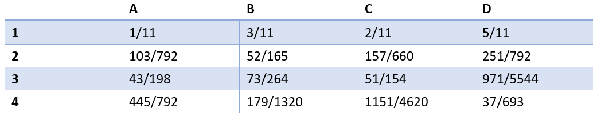
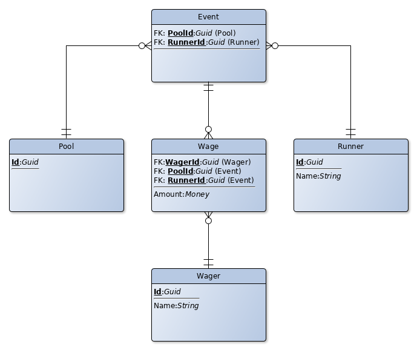
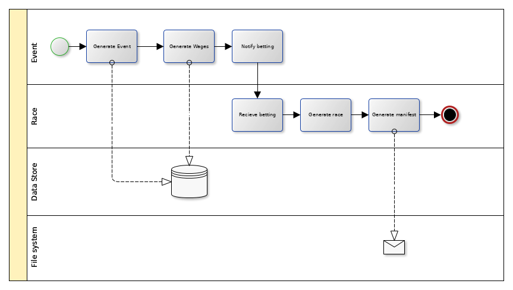

# Demo Pool Betting

Pool betting is all about odds and betting on a winner, or some combination of winners. This sample program,
written in .NET Core (v2.0), simulates the simple pool betting type of runners, where each runner has some odds
and random events yields a winner. The runners will develop during their lifespan, increasing or decreasing odds,
simulating real world events.

# Mathematics

There is a probability that a runner will end up on a given position in a race. Since each runner has an odds
to win, the probabilities changes accordingly as each runner gets a final position in the race ([Bayes' theorem](https://en.wikipedia.org/wiki/Bayes%27_theorem)).

For instance, assuming four runners, A, B, C and D, with probabilities [A in the first pace] P(A,1) = 1/11
(according to the odds), P(B,1) = 3/11, P(C,1) = 2/11 and P(D,1) = 5/11 (runner D has the best odds in the race),
and iterating through all of the possible outcomes P(A,1), P(A,2), P(A,3), P(A,4), and so on, gives

To read from the table, simply pick an event, e.g. P(A,1) [A on first place]. Then the row sum specifies that the probability
that either A, B, C or D ends up in the first place is 1, the column sum specifies the probability that runner A
ends up at either first, second, third or forth place is 1.

## Return from betting

Each better puts a wager on a runner. The sum of all wages makes up the total amount to be distributed to
the winners of the race. The betting houses usually takes a cut of the total amount, leaving the remainder to
be distributed to the winners.

# Betting types

The simulator supports simple pool bets where there is a winner in a race.

# Architecture

The demo is divided into two modules, one for handling the events and wages, and one for handling races. There
is a data store with a data model for events and wages. There will be a digitally signed manifest, with payouts,
for each race.

Communication between the modules will be through TCP/IP, and defined XML protocols.

## Data store model

The following data store model supports the simple pool betting type:

A pool contains multiple runners. A runner can in turn be selected into several pools. One wage is specific to
one pool, runner and wager. The wager may have several wages in the same and/or multiple pools. The notion of
event is used when the runner win.

## Process flow

The process flow is illustrated with the following BPMN (v2.0):

The flow represents a racing event. Each race is populated with a random number of wages and runners.

# How to run the simulator

Start up the **EventConsole** and the **RaceConsole** (order doesn't matter), then at the **EventConsole**
prompt set the **data connection string** with the command 'sc Data Source=./Store.db' (or any path to where
you want to put the store), generate a number of wagers and runners (use the command 'gw 50' and 'gr 20') (can
be anything up to 1000 of each).

Now you can use the command **race** (or short 'r') to perform a race, with the manifest (reciept) dropped into
the current working directory for the **RaceControl**.

To start **EventConsole** at the command prompt, use the command 'dotnet .\EventConsole.dll', and for the
**RaceControl**, use the command 'dotnet .\RaceControl.dll' at a second command prompt.

The default TCP port used by the consoles is '48801'.

